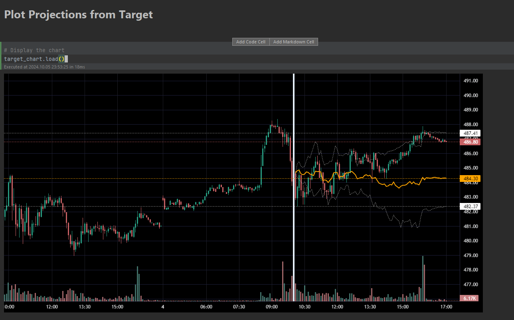

# Market Span Cluster

Search historical market data for similar time ranges using [Dynamic Time Warping](https://en.wikipedia.org/wiki/) distance.

Given an end of range timestamp, a start time of day, and a lookback range in days, we will search
for similar time ranges, and return the top N matches. The practical use of this would be to run this at the start of day,
using now() for the end of time range.

Market data is provided by the user. It should be in the form of OHLCV with a UTC timestamp. The data used here came from
[databento.com](https://databento.com).

The matches are scored using one of several variations of DTW. The default method will run DTW on the highs, lows,
and close, and return the average distance, with double weight on the close (hlc4). Lower distance is better.

The matches can be plotted with Tradingview lightweight charts by using the widget. Projection bands from the target window
can be also be plotted.

These main entrypoint is the Jupyter notebook `notebooks\search.ipynb`.



## Project Organization
This project was initially generated using the [Cookiecutter Data Science](https://cookiecutter-data-science.drivendata.org) 
template, then trimmed down.

```
├── LICENSE
├── Makefile              <- Makefile for convenience commands like `make data` or `make train`
├── README.md
├── docs 
├── data
│   ├── processed         <- The final, canonical data sets for modeling.
│   └── raw               <- The original, immutable data dump.
├── market_span_cluster   <- Source code for use in this project
├── notebooks
│   └── search.py         <- search.py the main app.
├── pyproject.toml
└── requirements.in
└── requirements.txt
```

--------

## Contributors
- Jade Koskela
- Claude.ai 3.5 Sonnet
- ChatGPT 4.o
